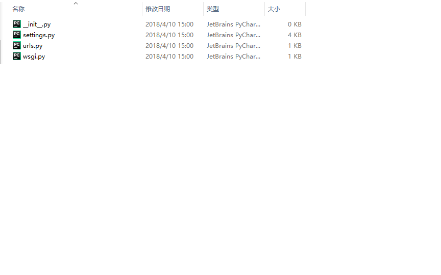

mtv模型:model, templates, views

查看Django版本
```py
import django
django.get_version()
```

创建Django项目:
    1.在合适位置创建目录，用来存放Django项目，切换至该目录打开cmd，执行
    ```shell
    django-admin startproject projectname
    ```
    
    
    目录层级说明:manage.py--命令行工具，可以使我们用多种方式对Django项目交互
    project目录:__init__.py 告诉python这个目录应该被当做包
                settings.py 项目配置文件
                urls.py项目路由声明
                wsgi.py项目与wsgi兼容的web服务器入口

基本操作:设计表结构-表名
                  -字段

windows10下操作mysql数据库:
    启动:
        ```shell
        net start mysql57
        ```
    关闭:
        ```shell
        net stop mysql57
        ```
命令行创建数据库:
    ```shell
    create database database_name
    ```
删除数据库:
    ```shell
    drop database database_name
    ```

Django settings中关于数据库的配置:
    ```python
    DATABASES = {
        'default': {
            'ENGINE': 'django.db.backends.mysql',
            'NAME': 'sunck',
            'USER': 'root',
            'PASSWORD': 'root',
            'HOST': 'localhost',
            'PORT': '3306',
        }
    }
    ```
另外还需要事先在__init__.py文件中写入
```python
import pymysql

pymysql.install_as_MySQLdb()
```
创建应用:
    在一个项目中可以创建多个应用，每个应用进行一种业务处理
    打开shell，进入djsite目录
    执行python manage.py startapp app_name

myApp目录说明:
    admin.py-站点配置
    modeles.py-模型
    views.py-视图

定义模型:
    概述:一个数据表对应一个模型
    引入from django.db import models
    模型类要继承models.Model类
    不需要定义主键，在生成时自动添加，并且值为自动增加的
    外键通过foreignKey来指定

```python
#对应数据库里的一张表
class Grades(models.Model):
    #模型类里的属性对应数据库里的字段
    gname = models.CharField(max_length=20)
    gdate = models.DateTimeField()
    ggirlnum = models.IntegerField()
    gboynum = models.IntegerField()
    isDelete = models.BooleanField(default=False)


class Student(models.Model):
    sname = models.CharField(max_length=20)
    sgender = models.BooleanField(default=True)
    sage = models.IntegerField()
    scountend = models.CharField(max_length=20)
    isDelete = models.BooleanField(default=False)
    sgrade = models.ForeignKey("Grades", on_delete=models.CASCADE)            #关联外键 此处和之前的版本略                                                                           #有不同
```